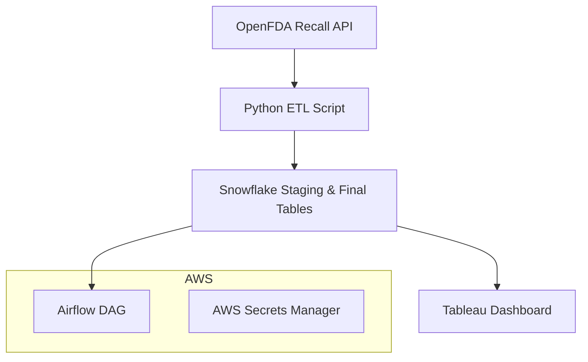

# 🧪 Pharmaceutical Recall Tracker + FDA Dashboard

A complete end-to-end data engineering and BI dashboard project that fetches real-time pharmaceutical recall data from the FDA, processes and stores it in Snowflake, and visualizes insights using Tableau. Built to support healthcare manufacturers and analysts with daily insights on recall patterns, product issues, and trends.

---

## 🔍 Features

- ✅ **Automated Data Ingestion** from [OpenFDA Recall API](https://open.fda.gov/apis/drug/drug-enforcement/)
- ❄️ **Snowflake Data Warehouse** setup with dynamic schema for staging and production
- ⚙️ **Airflow DAGs** for daily ETL orchestration and quality checks
- 📊 **Interactive Tableau Dashboard** with parameterized filtering (e.g., date, recall type, manufacturer)
- 🛠️ **Incident Detection & Scoring Module** for recall frequency tracking
- 🔐 Integrated with **AWS Secrets Manager** for secure credential handling

---

## 📈 Demo

> 🔗 [Demo Tableau Dashboard Preview](#) *(Link to Tableau Public or a hosted screenshot preview)*  
> 📸 **

---

## 🧵 Data Pipeline Flow



---

## ⚙️ Tech Stack

| Tool        | Purpose                        |
|-------------|--------------------------------|
| Python      | Data ingestion, transformation |
| Snowflake   | Data warehousing               |
| Airflow     | Orchestration + Scheduling     |
| Tableau     | Data visualization             |
| AWS S3      | Backup + archival storage      |
| Secrets Manager | Secure credentials         |

---

## 📂 Project Structure

```
fda-recall-dashboard/
│
├── dags/
│   └── fda_recall_dag.py          # Airflow DAG for daily pipeline
├── etl/
│   ├── fetch_fda_data.py          # Python script to fetch & clean data
│   └── transform_to_snowflake.py  # Script to load into Snowflake
├── sql/
│   ├── create_tables.sql          # Snowflake table DDLs
│   └── quality_checks.sql         # Data validation queries
├── tableau/
│   └── dashboard.twbx             # Packaged Tableau workbook
├── screenshots/
│   └── fda-dashboard-preview.png  # Preview image for README
└── README.md
```

---

## 🧠 Use Cases

- Regulatory teams monitoring **real-time drug recall alerts**
- Pharmaceutical companies tracking **product-level issues**
- Internal compliance teams building **recall response workflows**

---

## 🛡️ Security & Compliance

- Secrets (Snowflake credentials, API keys) are stored securely using **AWS Secrets Manager**
- Data is not stored permanently unless approved via Snowflake retention policies

---

## 🚀 Getting Started

### 1. Clone the repo
```bash
git clone https://github.com/your-username/fda-recall-dashboard.git
cd fda-recall-dashboard
```

### 2. Set up Python environment
```bash
pip install -r requirements.txt
```

### 3. Configure credentials
Store Snowflake + API credentials securely in AWS Secrets Manager or use `.env` during dev.

### 4. Run the ETL
```bash
python etl/fetch_fda_data.py
python etl/transform_to_snowflake.py
```

### 5. Schedule with Airflow
Load the DAG from `dags/` into your Airflow instance.

---

## 📢 Credits

Built by a Data Engineer passionate about building useful healthcare tools and solving real-world data chaos 💊

---

## 📬 Contact

Feel free to reach out via [Upwork](#), [LinkedIn](#), or [email](mailto:your@email.com) if you’d like a similar solution built for your business.

```

---

Want help generating the actual **ETL scripts**, **SQL DDLs**, or even a sample **Airflow DAG** to go with this README?
