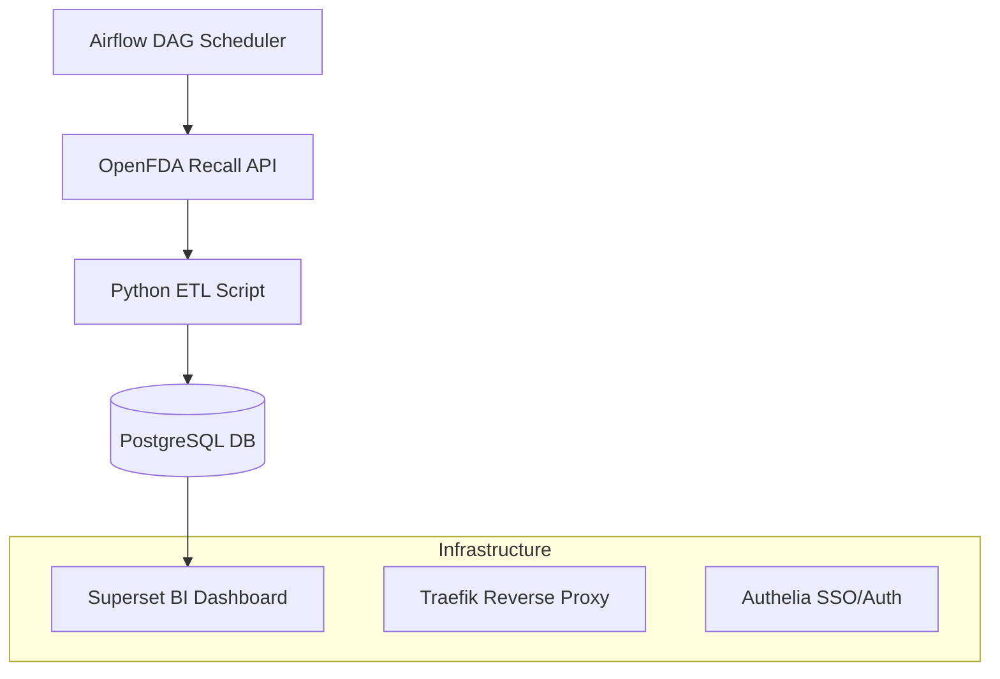
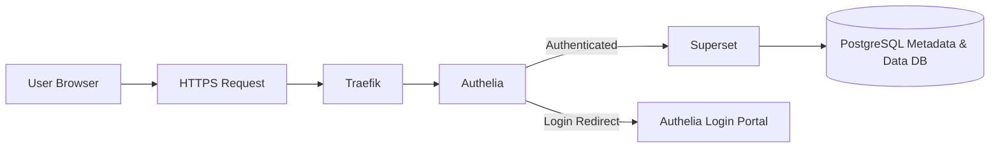

# 💊 Pharmaceutical Recall Tracker + Superset Dashboard (Modernized Deployment)

An end-to-end data engineering and analytics solution for real-time pharmaceutical recall tracking. This version enhances the stack with **Apache Superset** (deployed via Docker, Traefik, and Authelia) for self-hosted BI, while continuing to fetch recall data from the [OpenFDA API](https://open.fda.gov/apis/drug/drug-enforcement/), store and transform it in **PostgreSQL**, and automate orchestration using **Airflow**.

---

## 🔍 Features

- ✅ Real-time data ingestion from OpenFDA Recall API
- ⚙️ Airflow DAGs for orchestration, quality checks, and scoring
- 📊 Modern self-hosted **Superset Dashboard** (Dockerized)
- 🌐 Secured with **Traefik**, **Authelia SSO**, and HTTPS via Let's Encrypt
- 🧠 Incident Detection & Scoring for recall anomalies
- 🔐 AWS Secrets Manager for secure credential management
- 🐘 External PostgreSQL used as Superset's metadata DB
- 🐳 Fully containerized using **Docker Compose**

---

## 📈 Demo Preview

> 🔗 [Live Superset Dashboard](https://superset.tardisonline.in)
> 📸 

---

## 🧵 Data Pipeline Flow



---

## 🔐 Infrastructure: Superset + Authelia + Traefik



---

## ⚙️ Tech Stack

| Tool        | Purpose                           |
|-------------|-----------------------------------|
| Python      | ETL scripts, data transformation  |
| PostgreSQL  | Primary data + metadata storage   |
| Superset    | BI dashboard & visualizations     |
| Airflow     | Workflow orchestration (ETL jobs) |
| Docker      | Containerized local deployment    |
| Traefik     | Reverse proxy, SSL termination    |
| Authelia    | Authentication middleware (SSO)   |

---

## 📂 Project Structure

```
fda-recall-dashboard/
│
├── dags/                           
│   └── fda_pipeline_dag.py           # Airflow DAG for Daily Pipeline
├── etl/                            
│   ├── fetch_fda_data.py           # Pulls FDA Data
│   └── load_to_postgres.py         # Loads data to PostgreSQL
│   └── clean_data.py               # Cleans FDA Data
├── sql/                            
│   ├── create_tables.sql           # PostgreSQL table definitions
├── superset/                         
│   ├── superset-compose.yaml       # Superset + Traefik + Authelia setup
│   └── superset_config.py          # Secure config (SECRET_KEY, DB URI)
├── airflow/
│   ├── airflow-compose.yml         # Airflow stack (webserver, scheduler, etc.)
│   ├── dags/                      # DAG files
│   └── requirements.txt           # Custom Airflow Python deps
├── tableau/                        
│   └── dashboard.twbx
├── screenshots/
│   └── fda-dashboard-preview.png
└── README.md
```

---

## 🧠 Use Cases

- Monitor **drug recall alerts** in real-time from FDA
- Track **product-level safety issues** across manufacturers
- Build **internal dashboards** for QA, compliance, or regulatory

---

## 🚀 Getting Started

### 1. Clone the repository
```bash
git clone https://github.com/your-username/fda-recall-dashboard.git
cd fda-recall-dashboard/superset
```

---

## 🐳 Superset + Traefik + Authelia Setup

### 1. Navigate to the `superset/` directory
```bash
cd superset
```

### 2. Configure environment

Update:
- `superset_config.py`: Set a secure `SECRET_KEY` and PostgreSQL URI
- `authelia/configuration.yml`: Define your user, password, and authentication strategy

### 3. Launch Superset stack
```bash
docker-compose up -d
```

### 4. Create Superset Admin
```bash
docker exec -it superset superset fab create-admin \
  --username admin \
  --firstname Superset \
  --lastname Admin \
  --email admin@yourdomain.com \
  --password yourStrongPassword
```

### 5. Initialize Superset
```bash
docker exec -it superset superset db upgrade
docker exec -it superset superset init
```

> Access the dashboard at `https://superset.tardisonline.in` (Traefik will route via Authelia)

---

## 🎯 Airflow Setup

### 1. Navigate to the `airflow/` directory
```bash
cd airflow
```

### 2. Set up Airflow environment

Copy example environment file:
```bash
cp .env.example .env
```

You can adjust PostgreSQL URI and Airflow configs in `.env`.

### 3. Launch Airflow stack
```bash
docker-compose up -d
```

### 4. Initialize the database
```bash
docker-compose run airflow-webserver airflow db init
```

### 5. Create Airflow admin user
```bash
docker-compose run airflow-webserver airflow users create \
    --username admin \
    --password yourStrongPassword \
    --firstname Admin \
    --lastname User \
    --role Admin \
    --email admin@yourdomain.com
```

### 6. Access Airflow UI
Go to: [http://localhost:8080](http://localhost:8080)

---

## 🛡️ Security Notes

- All dashboard access is authenticated via Authelia (2FA supported)
- Reverse proxy is TLS-secured via Traefik
- Metadata and recall data are stored in PostgreSQL only (no external storage)

---

## 📬 Contact

Built by [Gopinath Sekar](https://www.linkedin.com/in/gopinath-sekar/), a data engineer obsessed with solving healthcare data chaos 💊

> 📧 [admin@thearchive.dev](mailto:admin@thearchive.dev)  
> 🌐 [Upwork Profile](https://www.upwork.com/freelancers/~018057852a30b567fe)
